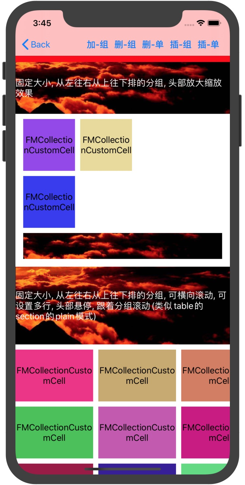
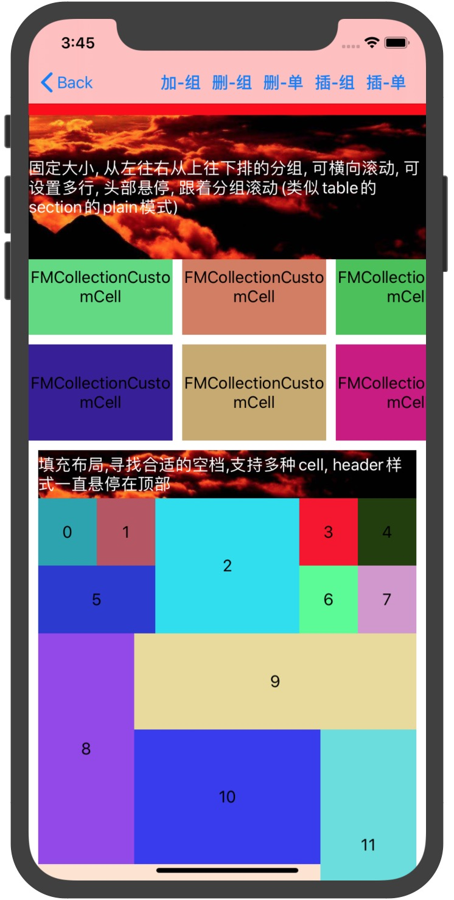
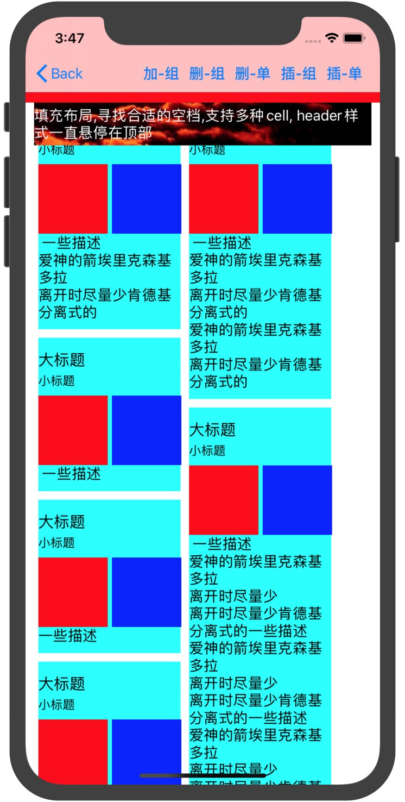
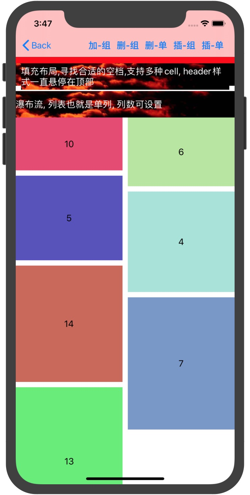
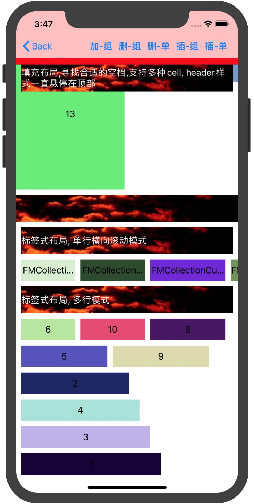
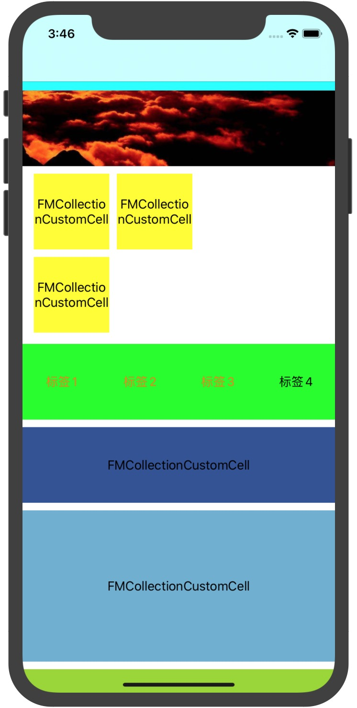
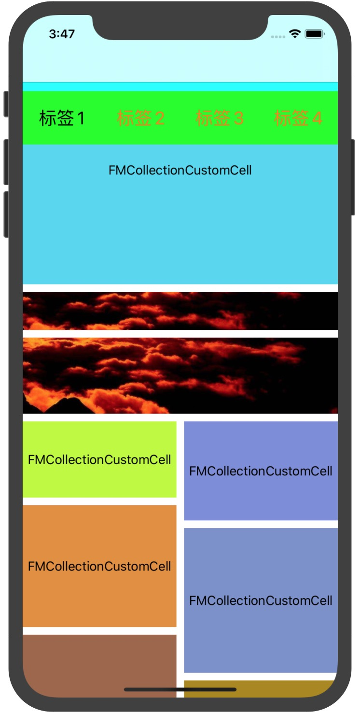

# FMLayoutKit

[](https://travis-ci.org/周发明/FMLayoutKit)
[](https://cocoapods.org/pods/FMLayoutKit)
[](https://cocoapods.org/pods/FMLayoutKit)
[](https://cocoapods.org/pods/FMCollectionLayout)


## 简介
### 一个可以让你更快的搞定复杂页面（电商首页，方格+列表多样式布局）的CollectionView自定义布局，目前支持纵向横向布局，可以穿插布局，动态cell高度做一些适配可以做到自动计算高度，也可以手动计算通过block返回，并且支持长按拖拽排序通过section以及layoutView开关控制是否可以拖拽排序,代码可以高度集中在一块，效果下面有演示，有什么问题随时issue我，感谢Star


## 安装方式

已发布到CocoaPods. podfile中添加以下代码:

```ruby
pod 'FMLayoutKit'
```

Spec的官方源实在拉取不下来的话，可以用我自己的一个Spec仓：
```ruby
https://gitee.com/Coder_FM/FMPodSpec.git
```

## 联系方式

周发明, zhoufaming251@163.com

## License

FMCollectionLayout is available under the MIT license. See the LICENSE file for more info.

## 提示

### 使用动态自动计算高度的时候  label的preferredMaxLayoutWidth属性请给一个准确的值  否则计算label布局的高度不准确
穿插其他方向的布局 请使用FMLayoutCrossSection将所需要显示的section包裹进去, 可以包裹多个分组布局, 该分组也可以增加头部底部以及背景等

## 支持的Cell布局样式以及头部悬停效果


#### 分组Cell样式1
单一Cell，固定大小，支持多列，从左往右，从上往下布局
#### 分组Cell样式2
单一Cell，固定大小，支持最大行数，从左往右，如果当前屏幕够放，不会滚动，多的才会滚动



#### 分组Cell样式3
可以多种Cell，block返回每一个item的大小，从左往右，从上往下，寻找最合适的位置放




#### 分组Cell样式4
瀑布流样式，支持多种cell样式，单列就是列表样式，列表可变，高度可以通过手动计算，也可以通过autolayout布局自动计算（续配置数据）


#### 分组Cell样式5
标签式布局，支持单种cell，可以单行滚动，也可以纵向布局，可限制最大行数（历史搜索记录那种样式）

#### 分组头部支持的样式有4种
- 一般样式跟着滚动
- 悬浮跟着分组滚动
- 一直悬浮，滚动置顶样式
- 第一个分组下拉放大效果（效果无法截图）

## 多屏滑动效果



每一个分组都可以设置头部，底部，背景，这三个都有inset可以设置内边距，灵活多变

特斯拉滚动视图是基于FMLayoutView的，共享的头部是一个FMLayoutView，横向每一屏都是FMLayoutView，最底部可以横向滚动是一个ScrollView，当触摸到头部的时候，ScrollView的pan手势会失效，横向滚动时，会将共享的头部移到最顶部视图上，滚动结束静止下来的时候，会将共享头部加到当前上下滚动的FMLayoutView，以达到效果

### 使用示例
``` objc
/// 创建CollectionView  delegate以及dataSource默认自己已遵守实现了一些方法
FMLayoutView *view = [[FMLayoutView alloc] init];
/// 需要布局的分组
[view.layout setSections:self.shareSections];
view.backgroundColor = [UIColor whiteColor];
[self.view addSubview:view];
[view mas_makeConstraints:^(MASConstraintMaker *make) {
    make.left.right.bottom.mas_equalTo(0);
    make.top.mas_equalTo(100);
}];
self.collectionView = view;

/// 固定大小 单一cell样式的分组
 FMLayoutFixedSection *section = [FMLayoutFixedSection sectionWithSectionInset:UIEdgeInsetsMake(0, 15, 15, 15) itemSpace:10 lineSpace:10 column:2];
/// 配置分组头部  高度以及view类
section.header = [FMLayoutHeader elementSize:100 viewClass:[FMCollectionCustomDecoration class]];
/// 头部最底距离item的间距
section.header.bottomMargin = 10;
/// 头部样式是否悬停
section.header.type = FMHeaderTypeSuspensionBigger;
/// 头部内边距
section.header.inset = UIEdgeInsetsMake(0, -15, 0, -15);
/// 
[section setConfigureHeaderData:^(FMLayoutBaseSection * _Nonnull section, UICollectionReusableView * _Nonnull header) {
    FMCollectionCustomDecoration *customHeader = (FMCollectionCustomDecoration *)header;
    customHeader.textLabel.text = @"固定大小, 从左往右从上往下排的分组, 头部放大缩放效果";
}];
/// 配置分组底部
section.footer = [FMLayoutFooter elementSize:50 viewClass:[FMCollectionCustomDecoration class]];
section.footer.topMargin = 10;

/// 配置Item样式
section.itemSize = CGSizeMake(100, 100);
section.itemDatas = [@[@"1", @"2", @"3"] mutableCopy];
/// cell的类 可以纯代码也可以Xib
section.cellElement = [FMLayoutElement elementWithViewClass:[FMCollectionCustomCell class]];
/// cell赋值数据
[section setConfigureCellData:^(FMLayoutBaseSection * _Nonnull section, UICollectionViewCell * _Nonnull cell, NSInteger item) {
    
}];
/// cell点击事件
[section setClickCellBlock:^(FMLayoutBaseSection * _Nonnull section, NSInteger item) {
    FMAddViewController *add = [[FMAddViewController alloc] init];
    [self.navigationController pushViewController:add animated:YES];
}];

#pragma mark --- 动态分组
/// cell类的数组
section.cellElements = @[[FMLayoutElement elementWithViewClass:[FMCollectionCustomCell class]]];
/// 需固定宽度
section.cellFixedSize = [UIScreen mainScreen].bounds.size.width;
/// 手动计算高度
[section setOtherBlock:^CGFloat(id  _Nonnull section, NSInteger item) {
    return 100 + item * 100;
}];
/// 或者可以自动计算高度  布局约束好  数据填充完
section.autoHeightFixedWidth = YES;

/// 对应index需要返回的reusedId来取对应的cell
[section setDeqCellReturnReuseId:^NSString * _Nonnull(FMLayoutDynamicSection * _Nonnull section, NSInteger index) {
    return [section.cellElements firstObject].reuseIdentifier;
}];

#pragma mark --- 标签分组
/// 不是单行的话  可以限制最大行数
section.maxLine = 6;
/// 固定每一个高度
section.cellFixedHeight = 40;
/// 返回对应的宽度
[section setWidthBlock:^CGFloat(id  _Nonnull section, NSInteger item) {
    return item * 20 + 100;
}];

#pragma mark --- 填充布局分组
/// 需返回大小  插入到合适的位置
[section setSizeBlock:^CGSize(id  _Nonnull section, NSInteger item) {
    switch (item) {
        case 2:
            return CGSizeMake(150, 140.32);
        case 5:
            return CGSizeMake((self.view.frame.size.width-20-150)/2, 70.19);
        case 8:
        case 11:
            return CGSizeMake(100, 240);
        case 10:
            return CGSizeMake(self.view.frame.size.width-20-200, 140);
        case 9:
        case 12:
            return CGSizeMake(self.view.frame.size.width-20-100, 100);
        case 0:
        case 1:
        case 3:
        case 4:
            return CGSizeMake((self.view.frame.size.width-20-150)/4, 70.13);
        default:
            return CGSizeMake((self.view.frame.size.width-20-150)/4, 70.19);
    }
}];

#pragma mark --- 特斯拉组件的使用说明  内部都是FMCollectionLayoutView的组合
/// 创建组件 遵守代理并实现必须的方法
FMTeslaLayoutView *multi = [[FMTeslaLayoutView alloc] init];
multi.delegate = self;
multi.dataSource = self;
[self.view addSubview:multi];
/// 悬停头部的最小高度 伸缩动画用
- (CGFloat)shareSuspensionMinHeightWithTesla:(FMTeslaLayoutView *)tesla{
    return 70;
}
/// 即将创建FMCollectionLayoutView  每一个分页只创建一个  懒加载
- (void)tesla:(FMTeslaLayoutView *)tesla willCreateLayoutViewWithIndex:(NSInteger)index{
    NSLog(@"willCreateLayoutViewWithIndex %ld", (long)index);
}
// 已创建FMCollectionLayoutView
- (void)tesla:(FMTeslaLayoutView *)tesla didCreatedLayoutViewWithIndex:(NSInteger)index layoutView:(FMCollectionLayoutView *)layoutView{
    NSLog(@"didCreatedLayoutViewWithIndex %ld", (long)index);
}
// 分页滚动到哪一页  并返回当前页的layoutView
- (void)tesla:(FMTeslaLayoutView *)tesla didScrollEnd:(NSInteger)index currentLayoutView:(nonnull FMCollectionLayoutView *)layoutView{
    [self.navTitleView selectWithIndex:index];
}
/// 分页个数
- (NSInteger)numberOfScreenInTesla:(nonnull FMTeslaLayoutView *)tesla {
    return 4;
}

/// 头部共享的集合
- (NSArray<FMLayoutBaseSection *> *)shareSectionsInTesla:(FMTeslaLayoutView *)tesla{
    return self.shareSections;
}

```
#### 版本更新
2020-08-21(1.1.6)
tesla优化修复bug, 填充布局支持间距

2020-08-02(1.1.6)
自动计算高度优化

2020-07-24(1.1.3)
iOS10,11自动计算高度奔溃的问题修复

2020-07-24(1.1.2)
合并分组优化, 创建完之后可以插入分组追加分组

2020-07-21(1.1.1)
合并取消支持拖拽, 会出现多重问题, 拖拽切换数据的问题修复

2020-07-21(1.1.0)
清楚长按拖拽View的背景色
长按拖拽可控制分组中某些item不支持拖拽, 修复合并分组的奔溃问题

2020-07-20(1.0.8)
代码优化, 新增动态布局不等宽的布局, 可实现更多种布局方案

2020-07-16(1.0.7)
优化tesla组件, 可以主创建scrollView  但是顶部边距空出来  不可用inset操作

2020-07-15(1.0.6)
新增长按拖拽  通过layoutView以及section控制开关。 新增纵向穿插横向布局自动滚到中间，并支持自定义根据进度做动画效果

2020-07-14(1.0.5)
修复分组头部底部背景重用标识符问题, 代码优化

2020-07-13(1.0.3)
放大缩小效果优化  新增是否可以黏在顶部
新增合并分组  将不同的cell合并到一个分组去

2020-07-09(1.0.2)
新增可复制分组, 以便于快读创建分组

2020-07-09
重写滚动到某一行的方法, 计算出偏移量

2020-07-08(1.0.1)
由老版本FMCollectionLayout优化更改名字FMLayoutKit重新上传

#### 感谢观看
有使用问题，欢迎联系我随时交流，QQ:847881570, 能Star一下的话，感激不尽
